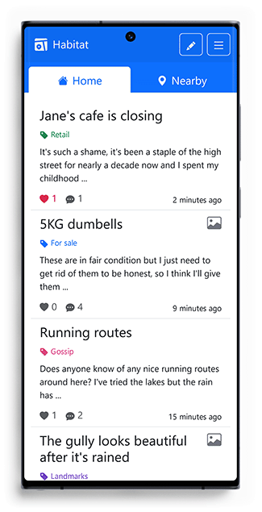
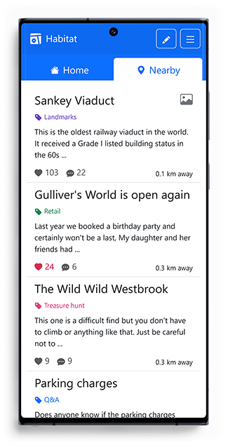
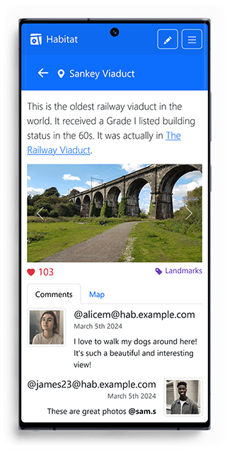

Over the past year or so I’ve been playing with the idea of a decentralised social platform based on your location. By putting physical location at the centre of the experience, such a platform could be used to bring communities together and provide a source of local information when travelling.

I’ll go into more detail on these points later, but for now, I need to very briefly explain why I think such a thing should be built.

## Why Should it Exist?

The concepts of the [Fediverse](https://en.wikipedia.org/wiki/Fediverse) and [Web3](https://en.wikipedia.org/wiki/Web3) play an important role in the future of communication on the internet. Platform decay (more widely known as enshittification), walled gardens, rage farming, and users becoming the product have all become the norm. These large platforms need to make a profit, and we’re slowly starting to discover that their methods of doing so are not good for us. In building open source and distributed social platforms, we also distribute the hosting costs and administration responsibilities. This ultimately gives people the freedom to choose how they want to communicate online.

Additionally, the idea of being an active member of the local community might sound increasingly enticing to those of us who are done with doomscrolling, but would still like to take part in local conversation. Whether to enact meaningful change in the community, to join a local jogging group, or even just to share a photo of the surrounding countryside.

Those who don’t care about any of those things could still benefit from the byproduct of conversations taking place around a specified location. Whether at home or away on holiday, perhaps in discovering an interesting landmark, or you might have a question about a place, the platform could tell you about existing conversations in and around the location you’re in, and if there are none, you could post one.

## Habitat: A Mockup

I've decided to build a proof of concept of a mobile interface that would demonstrate how such a platform could be used. I decided that _Habitat_ is as good a name as any.

I envision that Habitat will consist of two primary sections: _Home_ and _Nearby_. Both of these sections will display posts submitted by users.

### The Home Feed

The Home feed will display posts submitted directly to the user's own instance of Habitat, ordered by date. These posts will also be filtered by the user's preference of categories.

If desired, it could in theory be possible to create functionality for the user to essentially subscribe to multiple instances of Habitat, but the intention of this section is to show the user what is happening in their local area.

### The Nearby Feed

The Nearby section also displays posts, however there will be two key differences in their criteria:

* The posts will be ordered by distance from the user's current location, instead of by date.
* The posts will be sourced from any physically close Habitat instances, not neccessarily the instance that the user is a subscriber of.

I envision the Home feed as being for locals, and the Nearby feed as being for visitors.

### Categories

Given that location is such a broad area, it's easy to imagine that people would find the platform useful for very different reasons. Those interested in local landmarks may not be the same people as those interested in a book reading club.

For this reason, I think it would be important for administrators of an instance of Habitat to be able to create their own categories, and for users to be able to filter their feeds to display posts from specified categories.

Additionally, administrators may find that some categories are not suitable for the Nearby feed. For instance, they might decide that local gossip may be suitable for the Home feed, but visitors will likely be more interested in landmarks and local Q&A. To keep the Nearby feed clear of everyday local conversation, it would be good for administrators to have the ability to create categories that will only ever appear in the Home feed, or to put it another way, posts that will only ever display for those who are directly subscribed to their Habitat instance.

## Connecting Instances

Social platforms on the Fediverse have to deal with the issue of connecting with other instances. It seems that different platforms have varying degress of success with this challenge, by federating with select instances, but I think that a platform built around location would have a unique property that would give it a superpower when it comes to displaying posts from the relevant instances when a user opens the Nearby tab. To connect to the relevant Habitat instances no matter where in the world the user is, we need to harness this superpower.

### The Power of Coordinates

Lat/long co-ordinates are trivial to query by distance from a MySQL database. Utilising this, we could create a list of Habitat instances that are relevant to a user's current location, and then query only those instances.

This query could be performed locally, so long as each Habitat instance is aware of the network as a whole. This problem requires that a shared list of all instances is communicated and routinely updated amongst connected instances.

### Gossip Protocol

[Gossip protocol](https://en.wikipedia.org/wiki/Gossip_protocol) to the rescue! This is a process by which nodes of a network routinely query each other to update shared information.

In our scenario, instances of Habitat would ideally have a special relationship with literal neighbouring instances. This special relationship would allow the instances to routinely compare their lists of all instances. Let's call this special relationship BFFs (Best Federated Friends)!

For example, Habitat:London might choose to be BFFs with Habitat:Birmingham, Habitat:Peterborough and Habitat:Norwich. Habitat:Birmingham might choose to be BFFs with Habitat:Notthingham and Habitat:Cardiff also. You'll have to take this example with a pinch of salt, given that we haven't discussed how large an instance should ideally be, but you hopefully get the idea.

I've created a short visual to demonstrate this. Each circle represents a Habitat instance, and the lines represent BFF relationships between instances.



The video is sped up, perhaps a once a day sync would be more than enough to keep the network reasonably up-to-date at all times.

The flashing lines show a query between two instances. As a new instance is added to the network, knowledge of its existence propogates throughout the entire network. In this video, when an instance turns blue, it has a complete list of the entire network.

It may also benefit the network as a whole for some instances to be BFFs with locationally distant instances to reduce propogation time, but doing so may come with a downside. Users are probably more likely to be travelling to neighbouring towns and cities than to somewhere distant, and when using the Nearby functionality, they would better benefit from a sooner update from local instances.

These are really only problems after thousands of connected instances. But when sharing a list of URLs and co-ordinates of an entire decentralised network, it's certainly something that should be considered.

## Growing Pains

As such a network grows, it would become more resource intensive to routinely share a full list of all instances. Something as simple as a static file-based cache for the list will probably go a long way to help with this. With only a few thousand instances, the list might not be much different in filesize than this very article. One download twice a day, that sounds easily doable. But I'm thinking about the ideal scenario. Ideally, my local town would have it's own instance. Small instances that are cheap to host with truly local posts would be the dream, but that dream requires something more carefully considered than routinely comparing a list of potentially millions of URLs and co-ordinates.

### Bloom Filters

A [Bloom filter](https://en.wikipedia.org/wiki/Bloom_filter) is a method we can use to have an instance request a string which represents a neighbour's list. This string would be substantially smaller than the list itself. The instance could use this string to generate a list of instances which its neighbour is missing and send only those items back. The neighbouring instance could then do the same so that both instances will end up with identical lists.

### How big is too big?

Given that such a social platform would be fragmented by nature, it would be unsurprising to find that gaining a flourishing community in a single instance would be a challenge. For this reason, it might be tempting to create larger instances. This is not how I personally envision such a platform, but it's important to consider the best path to that ideal.

It may be important for an administrator to be able to create _Areas_ within their instance so that users can further filter by their local district. What if, after growing, the administrator would prefer to not pay for and administer the hosting of their entire county, but instead only for their local town? Perhaps it should be possible to export data for entire _Areas_ to be moved to new instances. Or, perhaps the simpler solution, it should be possible for some administrators to be given permissions to administer specific _Areas_ of an instance only.

## Let's wrap this up

In conclusion, to the best of my knowledge, it should be feasible to build a decentralised social platform that will allow users to submit and see content relevant to their location, even when traveling. 

Here are some questions for you:

* Do you foresee any technical hurdles that I've missed?
* Would you use it?
